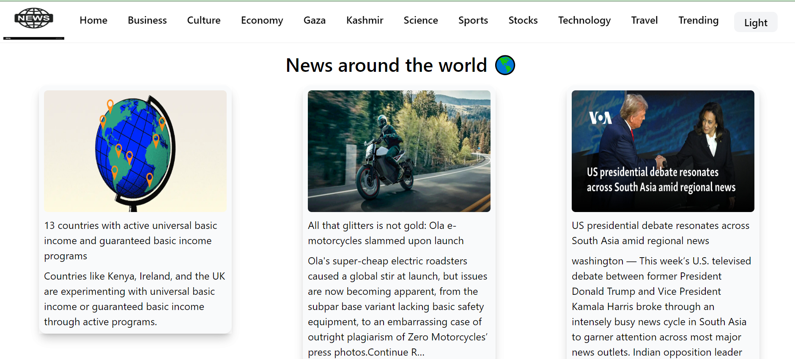
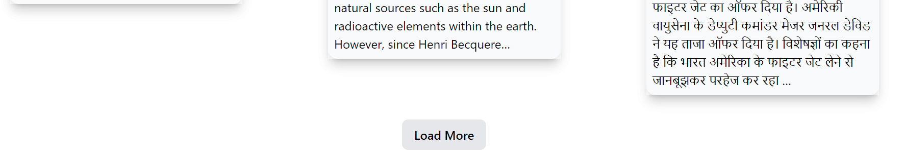
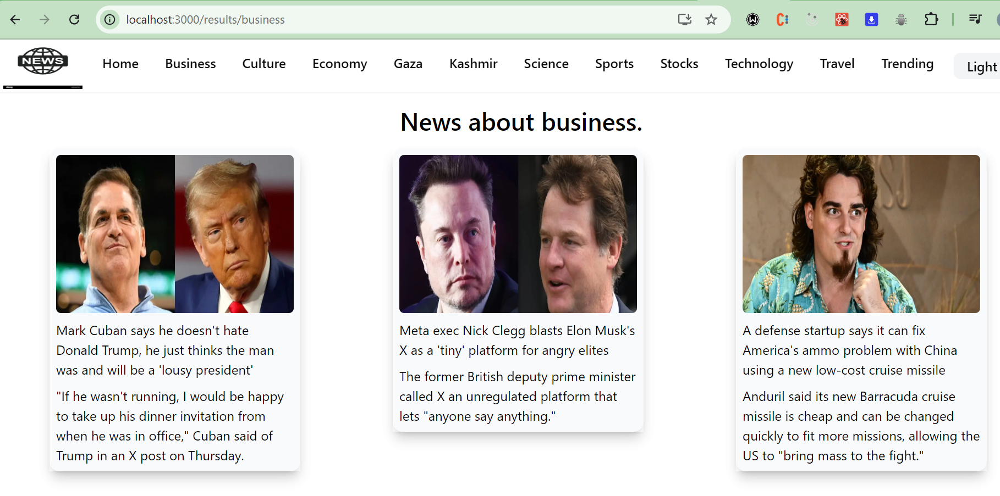
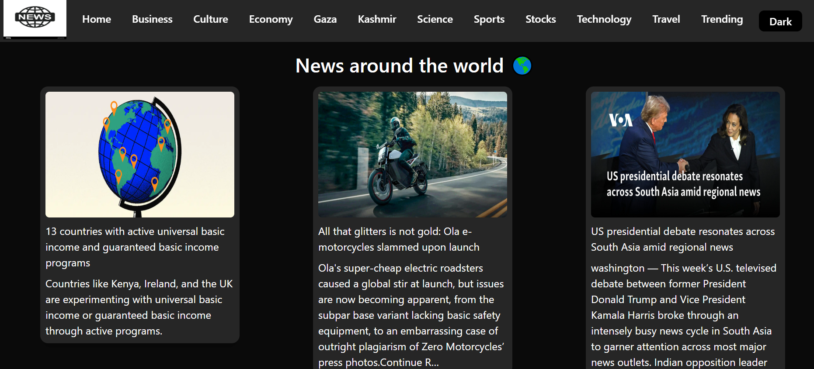

### Creating the project

This project is created using create-react-app.

### How to run the project

npm start or npm run start, it should run the project, before that make sure to install all the dependencies.

### Api used

The API used is https://newsapi.org/
I have provided my own api-key but make sure to use your own.

### Data provided by api

The news data provided by the api is the latest news around the globe.

### Refer below screenshots to see the look

